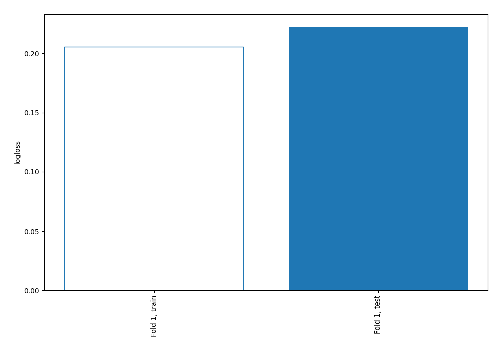
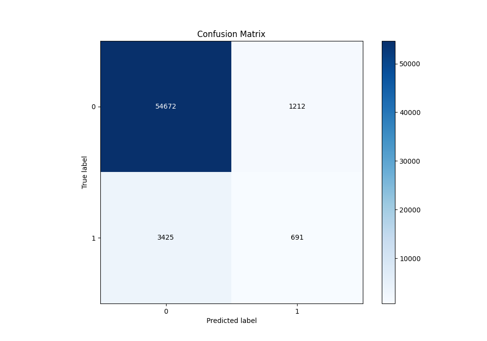
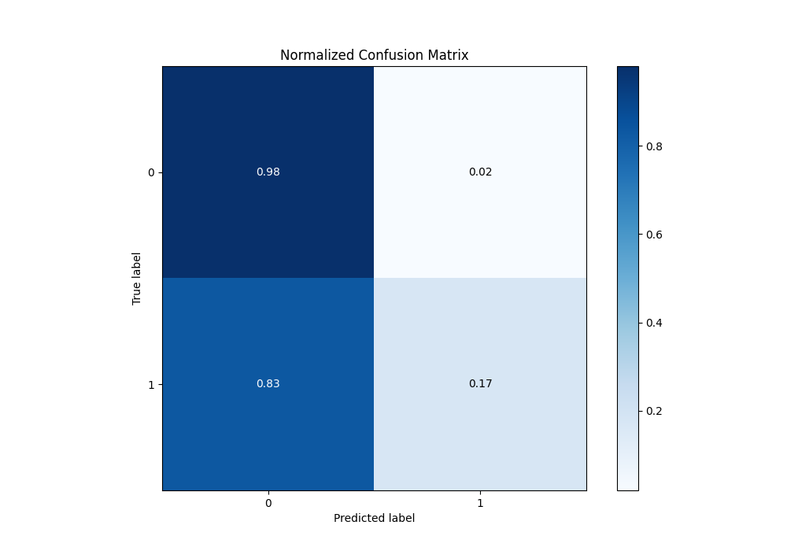
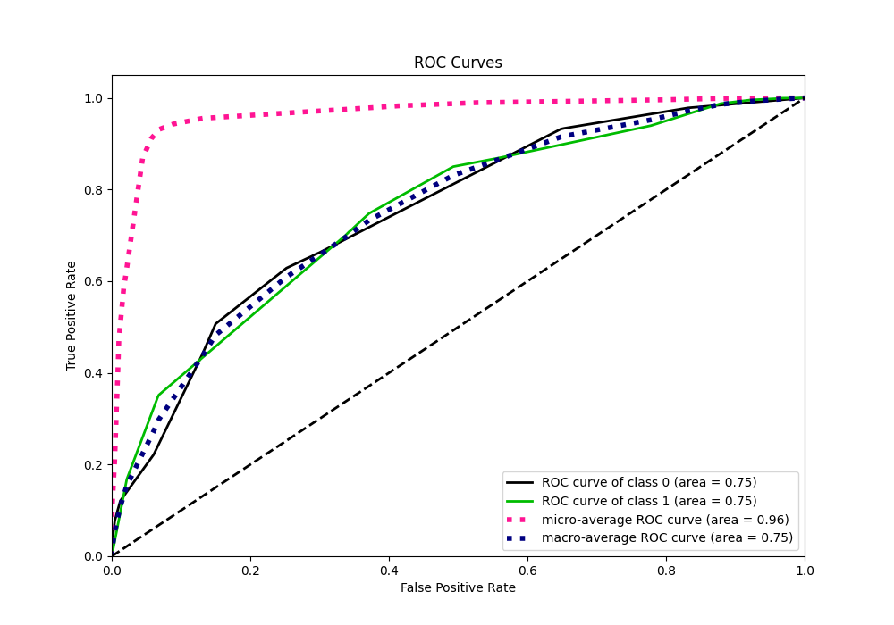
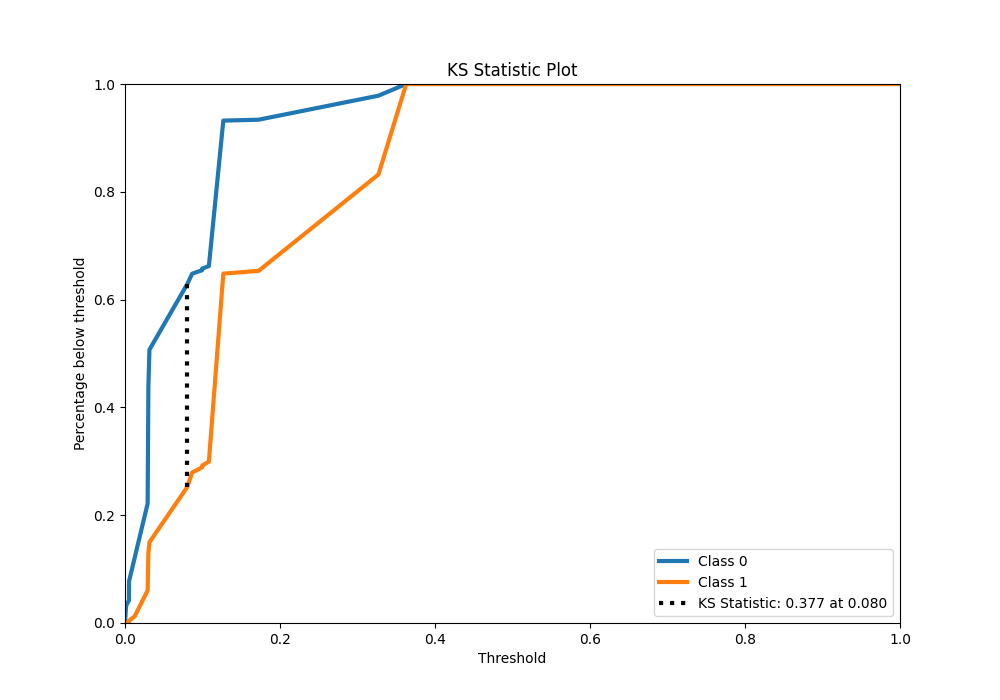
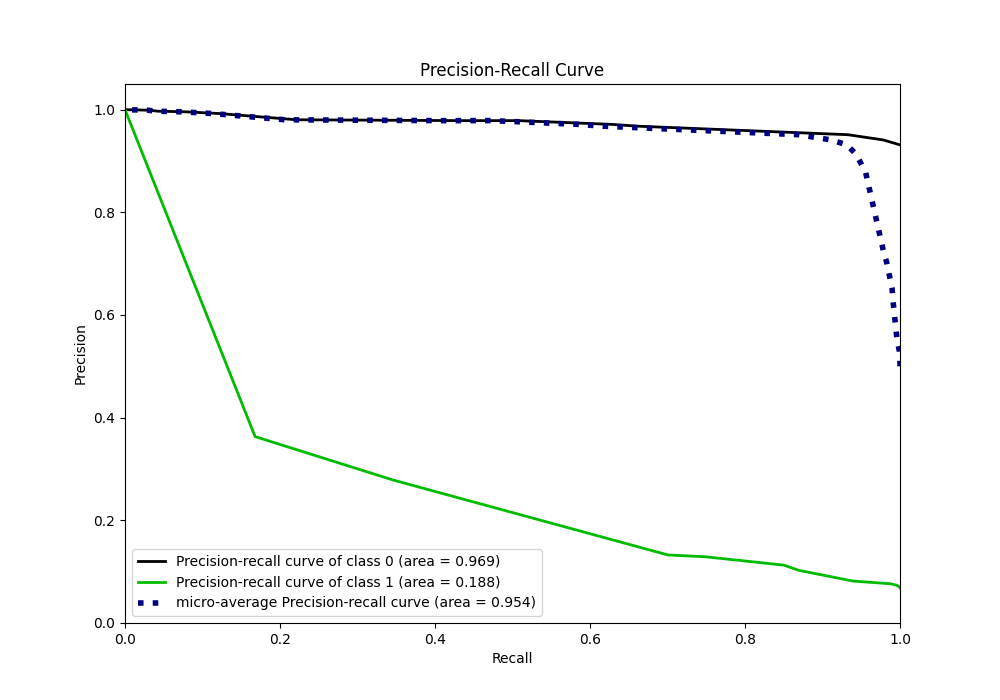
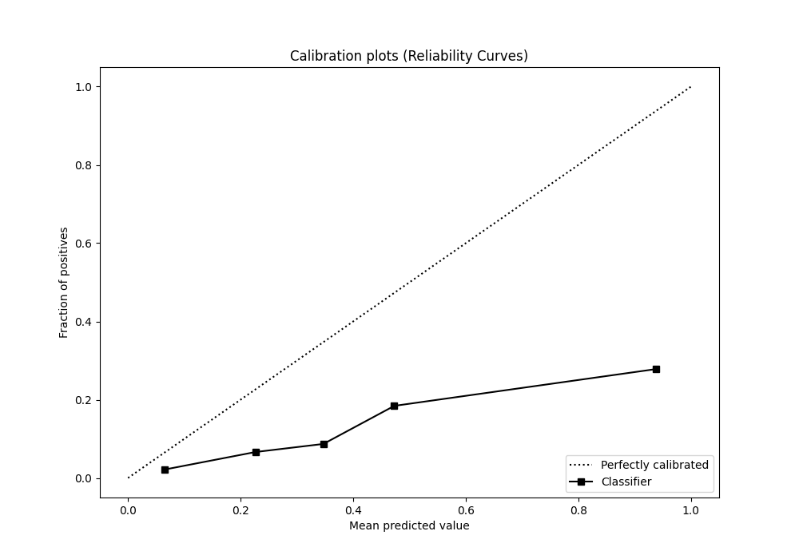
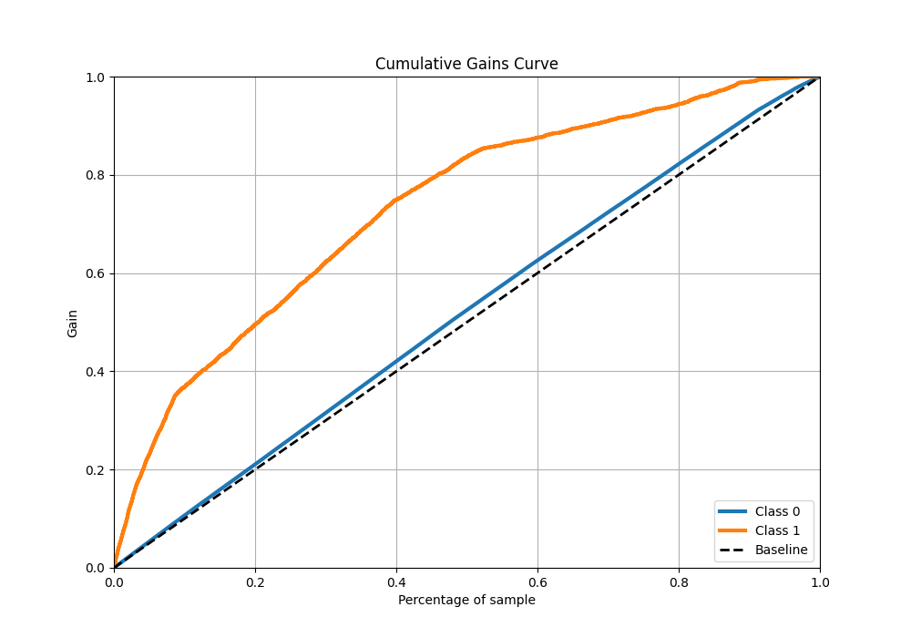
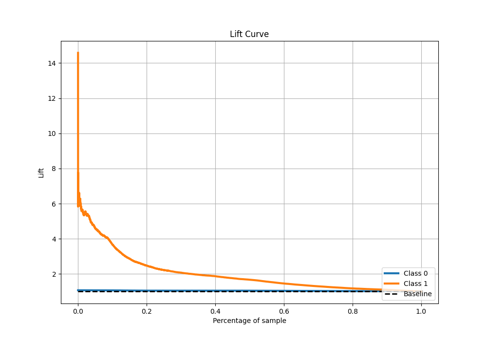

# Summary of 2_DecisionTree

[<< Go back](../README.md)

## Decision Tree
- **n_jobs**: -1
- **criterion**: entropy
- **max_depth**: 4
- **explain_level**: 2

## Validation
 - **validation_type**: split
 - **train_ratio**: 0.75
 - **shuffle**: True
 - **stratify**: True

## Optimized metric
logloss

## Training time

132.4 seconds

## Metric details
|           |    score |    threshold |
|:----------|---------:|-------------:|
| logloss   | 0.222161 | nan          |
| auc       | 0.749963 | nan          |
| f1        | 0.309402 |   0.126857   |
| accuracy  | 0.922717 |   0.32701    |
| precision | 0.363111 |   0.32701    |
| recall    | 1        |   0.00126478 |
| mcc       | 0.254071 |   0.126857   |

## Metric details with threshold from accuracy metric
|           |    score |   threshold |
|:----------|---------:|------------:|
| logloss   | 0.222161 |   nan       |
| auc       | 0.749963 |   nan       |
| f1        | 0.229606 |     0.32701 |
| accuracy  | 0.922717 |     0.32701 |
| precision | 0.363111 |     0.32701 |
| recall    | 0.167881 |     0.32701 |
| mcc       | 0.210869 |     0.32701 |

## Confusion matrix (at threshold=0.32701)
|              |   Predicted as 0 |   Predicted as 1 |
|:-------------|-----------------:|-----------------:|
| Labeled as 0 |            54672 |             1212 |
| Labeled as 1 |             3425 |              691 |

## Learning curves

## Confusion Matrix

## Normalized Confusion Matrix

## ROC Curve

## Kolmogorov-Smirnov Statistic

## Precision-Recall Curve

## Calibration Curve

## Cumulative Gains Curve

## Lift Curve

[<< Go back](../README.md)
