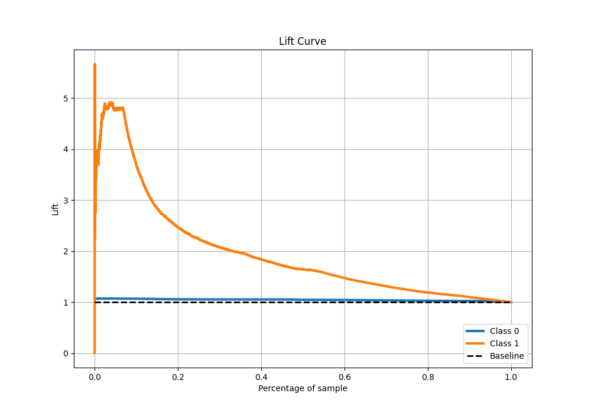

# Summary of 2_DecisionTree_GoldenFeatures

[<< Go back](../README.md)

## Decision Tree
- **n_jobs**: -1
- **criterion**: entropy
- **max_depth**: 4
- **explain_level**: 2

## Validation
 - **validation_type**: split
 - **train_ratio**: 0.75
 - **shuffle**: True
 - **stratify**: True

## Optimized metric
logloss

## Training time

128.2 seconds

## Metric details
|           |    score |    threshold |
|:----------|---------:|-------------:|
| logloss   | 0.219555 | nan          |
| auc       | 0.751138 | nan          |
| f1        | 0.328546 |   0.126878   |
| accuracy  | 0.927117 |   0.346464   |
| precision | 0.326457 |   0.126878   |
| recall    | 1        |   0.00198572 |
| mcc       | 0.278758 |   0.126878   |

## Metric details with threshold from accuracy metric
|           |     score |   threshold |
|:----------|----------:|------------:|
| logloss   | 0.219555  |  nan        |
| auc       | 0.751138  |  nan        |
| f1        | 0.0581521 |    0.346464 |
| accuracy  | 0.927117  |    0.346464 |
| precision | 0.256167  |    0.346464 |
| recall    | 0.0327988 |    0.346464 |
| mcc       | 0.0698508 |    0.346464 |

## Confusion matrix (at threshold=0.346464)
|              |   Predicted as 0 |   Predicted as 1 |
|:-------------|-----------------:|-----------------:|
| Labeled as 0 |            55492 |              392 |
| Labeled as 1 |             3981 |              135 |

## Learning curves

## Confusion Matrix

## Normalized Confusion Matrix

## ROC Curve

## Kolmogorov-Smirnov Statistic

## Precision-Recall Curve

## Calibration Curve

## Cumulative Gains Curve

## Lift Curve

[<< Go back](../README.md)
