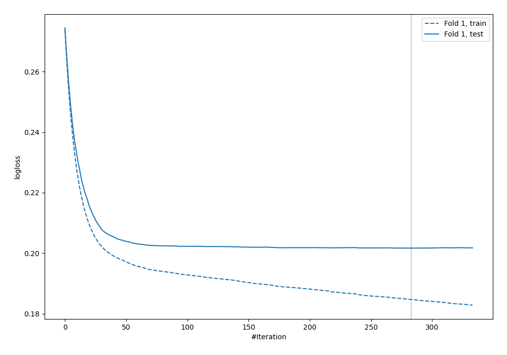

# Summary of 3_Default_Xgboost

[<< Go back](../README.md)

## Extreme Gradient Boosting (Xgboost)
- **n_jobs**: -1
- **objective**: binary:logistic
- **eta**: 0.075
- **max_depth**: 6
- **min_child_weight**: 1
- **subsample**: 1.0
- **colsample_bytree**: 1.0
- **eval_metric**: logloss
- **explain_level**: 2

## Validation
 - **validation_type**: split
 - **train_ratio**: 0.75
 - **shuffle**: True
 - **stratify**: True

## Optimized metric
logloss

## Training time

128.3 seconds

## Metric details
|           |    score |     threshold |
|:----------|---------:|--------------:|
| logloss   | 0.201696 | nan           |
| auc       | 0.822041 | nan           |
| f1        | 0.347872 |   0.175639    |
| accuracy  | 0.93075  |   0.44077     |
| precision | 0.467446 |   0.44077     |
| recall    | 1        |   0.000553567 |
| mcc       | 0.295999 |   0.175639    |

## Metric details with threshold from accuracy metric
|           |     score |   threshold |
|:----------|----------:|------------:|
| logloss   | 0.201696  |   nan       |
| auc       | 0.822041  |   nan       |
| f1        | 0.11877   |     0.44077 |
| accuracy  | 0.93075   |     0.44077 |
| precision | 0.467446  |     0.44077 |
| recall    | 0.0680272 |     0.44077 |
| mcc       | 0.15845   |     0.44077 |

## Confusion matrix (at threshold=0.44077)
|              |   Predicted as 0 |   Predicted as 1 |
|:-------------|-----------------:|-----------------:|
| Labeled as 0 |            55565 |              319 |
| Labeled as 1 |             3836 |              280 |

## Learning curves

## Confusion Matrix

## Normalized Confusion Matrix

## ROC Curve

## Kolmogorov-Smirnov Statistic

## Precision-Recall Curve

## Calibration Curve

## Cumulative Gains Curve

## Lift Curve

[<< Go back](../README.md)
