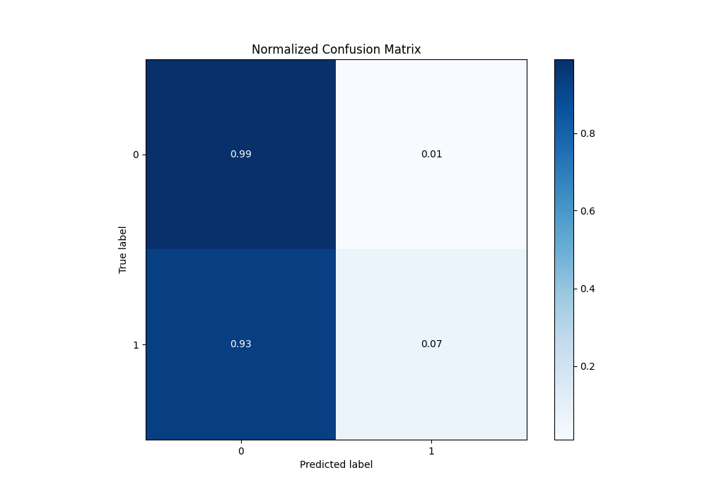

# Summary of 3_Default_Xgboost_GoldenFeatures

[<< Go back](../README.md)

## Extreme Gradient Boosting (Xgboost)
- **n_jobs**: -1
- **objective**: binary:logistic
- **eta**: 0.075
- **max_depth**: 6
- **min_child_weight**: 1
- **subsample**: 1.0
- **colsample_bytree**: 1.0
- **eval_metric**: logloss
- **explain_level**: 2

## Validation
 - **validation_type**: split
 - **train_ratio**: 0.75
 - **shuffle**: True
 - **stratify**: True

## Optimized metric
logloss

## Training time

128.4 seconds

## Metric details
|           |    score |     threshold |
|:----------|---------:|--------------:|
| logloss   | 0.201963 | nan           |
| auc       | 0.82174  | nan           |
| f1        | 0.34556  |   0.174912    |
| accuracy  | 0.930417 |   0.438242    |
| precision | 0.450751 |   0.438242    |
| recall    | 1        |   0.000616663 |
| mcc       | 0.293573 |   0.145551    |

## Metric details with threshold from accuracy metric
|           |     score |   threshold |
|:----------|----------:|------------:|
| logloss   | 0.201963  |  nan        |
| auc       | 0.82174   |  nan        |
| f1        | 0.114528  |    0.438242 |
| accuracy  | 0.930417  |    0.438242 |
| precision | 0.450751  |    0.438242 |
| recall    | 0.0655977 |    0.438242 |
| mcc       | 0.151817  |    0.438242 |

## Confusion matrix (at threshold=0.438242)
|              |   Predicted as 0 |   Predicted as 1 |
|:-------------|-----------------:|-----------------:|
| Labeled as 0 |            55555 |              329 |
| Labeled as 1 |             3846 |              270 |

## Learning curves

## Confusion Matrix

## Normalized Confusion Matrix

## ROC Curve

## Kolmogorov-Smirnov Statistic

## Precision-Recall Curve

## Calibration Curve

## Cumulative Gains Curve

## Lift Curve

[<< Go back](../README.md)
