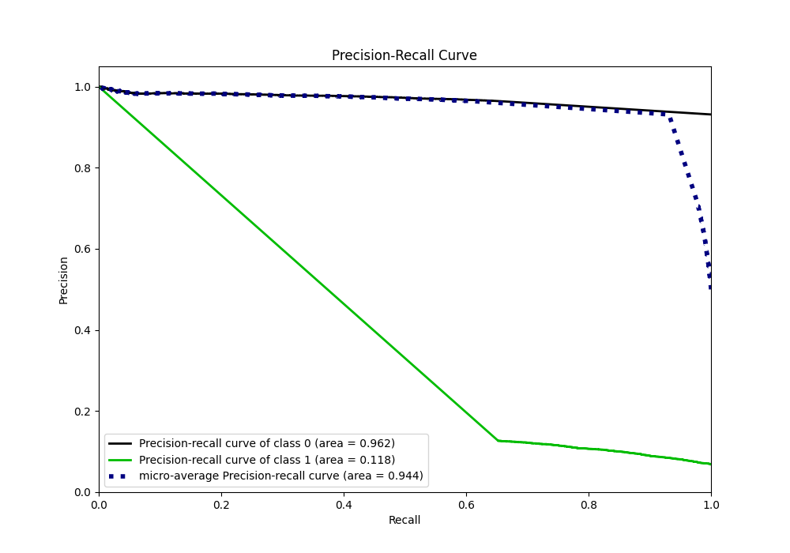

# Summary of 4_Default_NeuralNetwork

[<< Go back](../README.md)

## Neural Network
- **n_jobs**: -1
- **dense_1_size**: 32
- **dense_2_size**: 16
- **learning_rate**: 0.05
- **explain_level**: 2

## Validation
 - **validation_type**: split
 - **train_ratio**: 0.75
 - **shuffle**: True
 - **stratify**: True

## Optimized metric
logloss

## Training time

143.1 seconds

## Metric details
|           |    score |     threshold |
|:----------|---------:|--------------:|
| logloss   | 0.235937 | nan           |
| auc       | 0.694712 | nan           |
| f1        | 0.211239 |   0.116338    |
| accuracy  | 0.66195  |   0.116338    |
| precision | 0.125747 |   0.116338    |
| recall    | 1        |   7.56648e-05 |
| mcc       | 0.170984 |   0.108263    |

## Metric details with threshold from accuracy metric
|           |    score |   threshold |
|:----------|---------:|------------:|
| logloss   | 0.235937 |  nan        |
| auc       | 0.694712 |  nan        |
| f1        | 0.211239 |    0.116338 |
| accuracy  | 0.66195  |    0.116338 |
| precision | 0.125747 |    0.116338 |
| recall    | 0.659864 |    0.116338 |
| mcc       | 0.169553 |    0.116338 |

## Confusion matrix (at threshold=0.116338)
|              |   Predicted as 0 |   Predicted as 1 |
|:-------------|-----------------:|-----------------:|
| Labeled as 0 |            37001 |            18883 |
| Labeled as 1 |             1400 |             2716 |

## Learning curves

## Confusion Matrix

## Normalized Confusion Matrix

## ROC Curve

## Kolmogorov-Smirnov Statistic

## Precision-Recall Curve

## Calibration Curve

## Cumulative Gains Curve

## Lift Curve

[<< Go back](../README.md)
