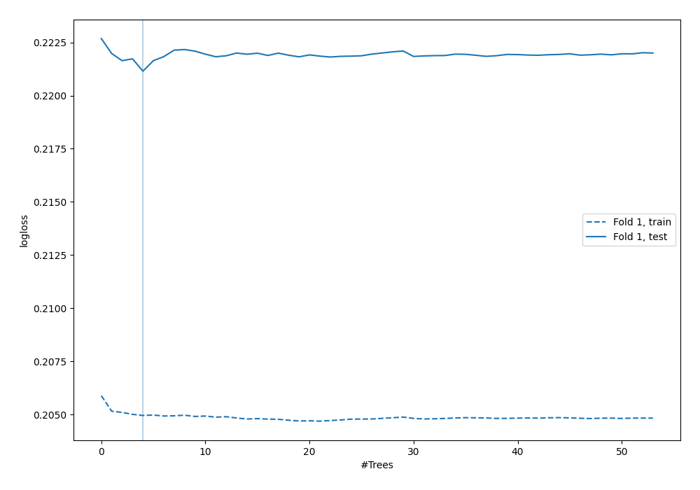
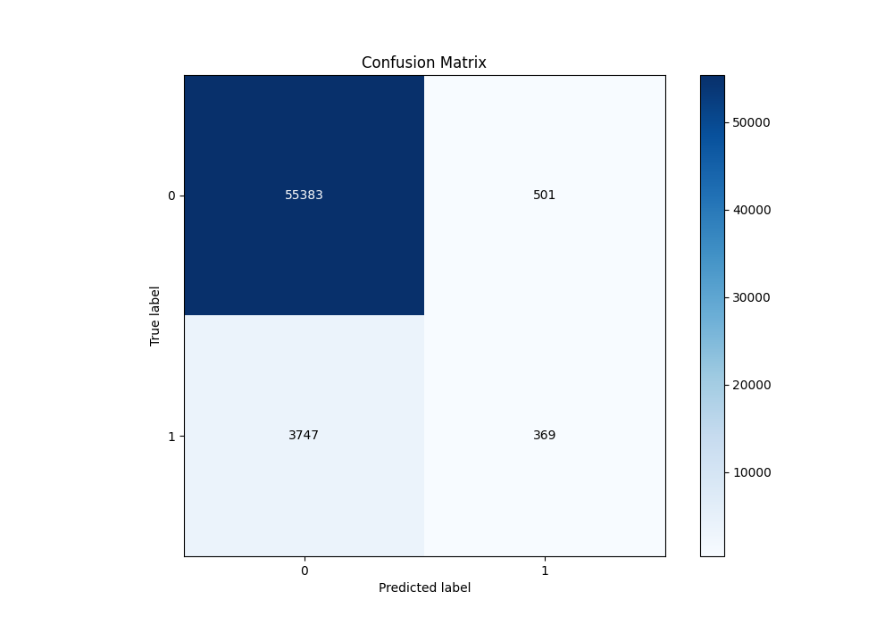
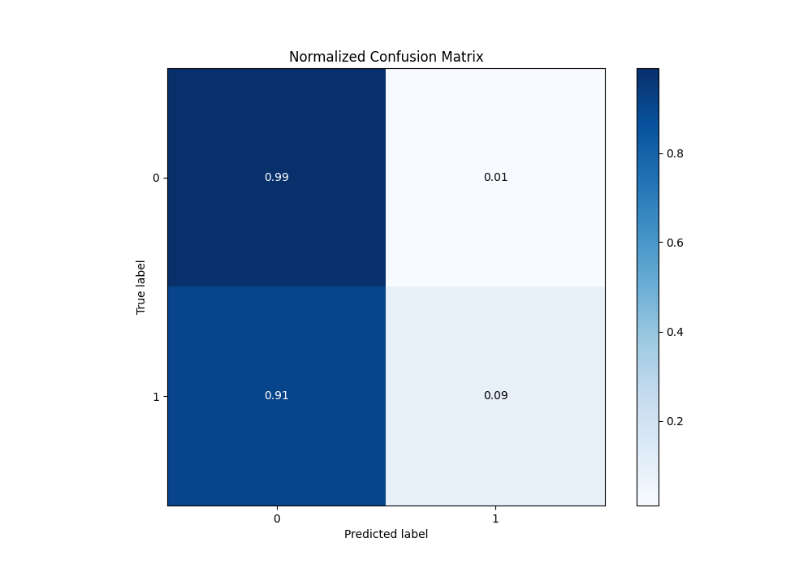
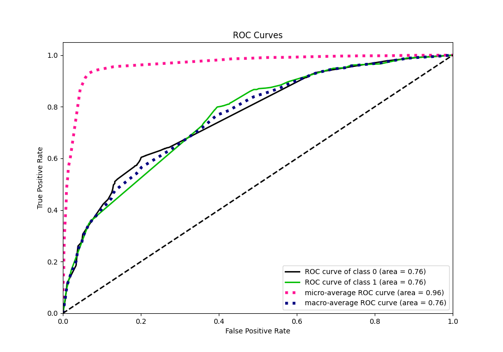
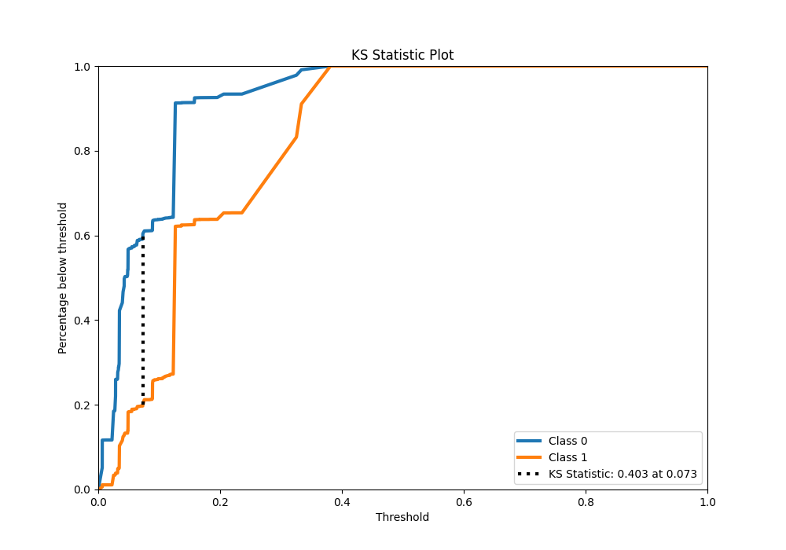
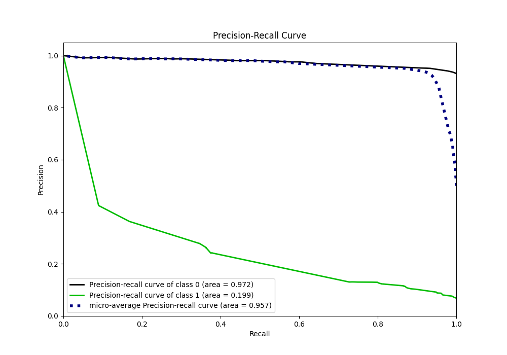
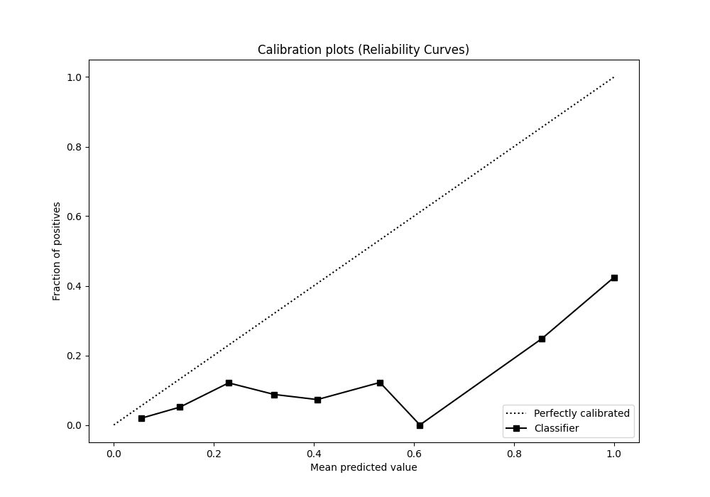
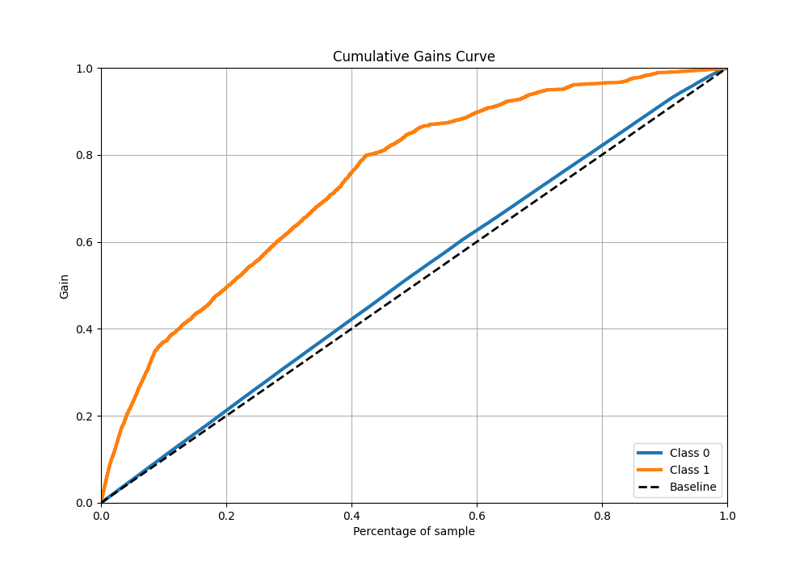
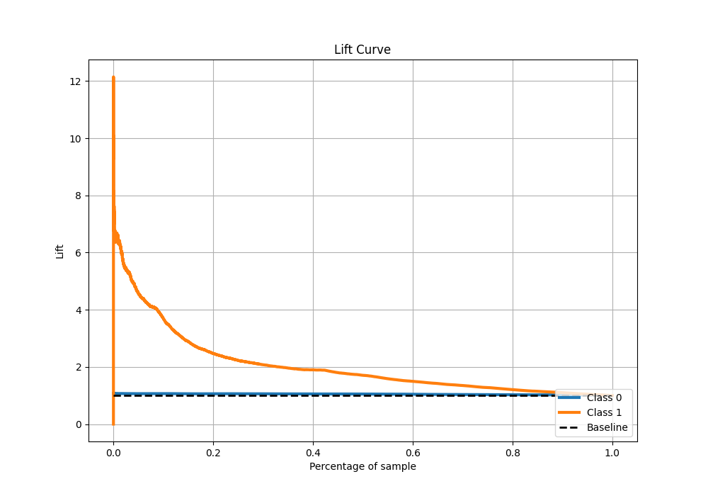

# Summary of 5_Default_RandomForest

[<< Go back](../README.md)

## Random Forest
- **n_jobs**: -1
- **criterion**: gini
- **max_features**: 0.9
- **min_samples_split**: 30
- **max_depth**: 4
- **eval_metric_name**: logloss
- **explain_level**: 2

## Validation
 - **validation_type**: split
 - **train_ratio**: 0.75
 - **shuffle**: True
 - **stratify**: True

## Optimized metric
logloss

## Training time

602.1 seconds

## Metric details
|           |    score |    threshold |
|:----------|---------:|-------------:|
| logloss   | 0.221147 | nan          |
| auc       | 0.761092 | nan          |
| f1        | 0.308757 |   0.205884   |
| accuracy  | 0.9292   |   0.333517   |
| precision | 0.424138 |   0.333517   |
| recall    | 1        |   0.00588364 |
| mcc       | 0.253586 |   0.205884   |

## Metric details with threshold from accuracy metric
|           |     score |   threshold |
|:----------|----------:|------------:|
| logloss   | 0.221147  |  nan        |
| auc       | 0.761092  |  nan        |
| f1        | 0.148014  |    0.333517 |
| accuracy  | 0.9292    |    0.333517 |
| precision | 0.424138  |    0.333517 |
| recall    | 0.0896501 |    0.333517 |
| mcc       | 0.170613  |    0.333517 |

## Confusion matrix (at threshold=0.333517)
|              |   Predicted as 0 |   Predicted as 1 |
|:-------------|-----------------:|-----------------:|
| Labeled as 0 |            55383 |              501 |
| Labeled as 1 |             3747 |              369 |

## Learning curves

## Confusion Matrix

## Normalized Confusion Matrix

## ROC Curve

## Kolmogorov-Smirnov Statistic

## Precision-Recall Curve

## Calibration Curve

## Cumulative Gains Curve

## Lift Curve

[<< Go back](../README.md)
