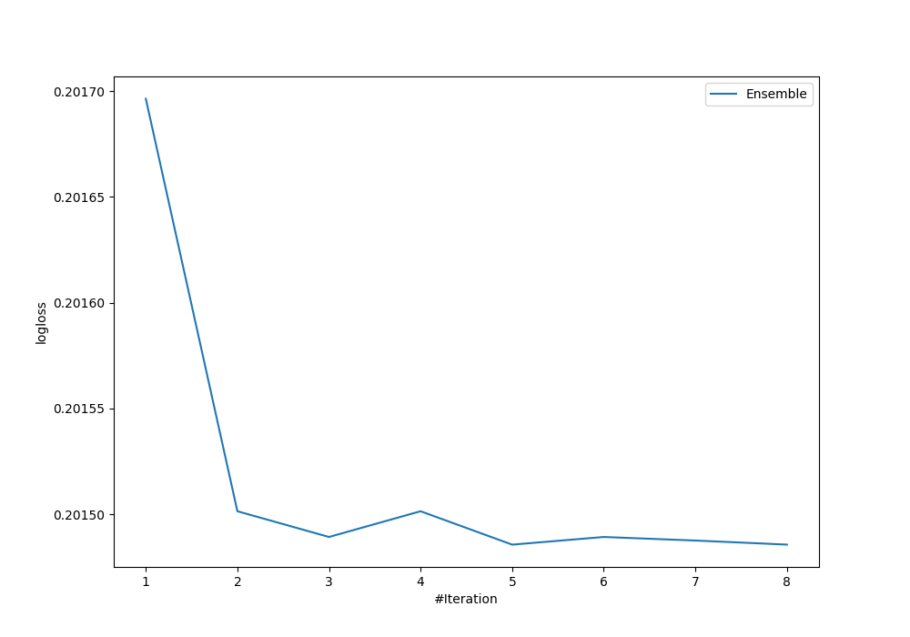

# Summary of Ensemble

[<< Go back](../README.md)

## Ensemble structure
| Model                            |   Weight |
|:---------------------------------|---------:|
| 3_Default_Xgboost                |        3 |
| 3_Default_Xgboost_GoldenFeatures |        2 |

## Metric details
|           |    score |     threshold |
|:----------|---------:|--------------:|
| logloss   | 0.201486 | nan           |
| auc       | 0.822858 | nan           |
| f1        | 0.347314 |   0.175358    |
| accuracy  | 0.930417 |   0.438295    |
| precision | 0.450751 |   0.438295    |
| recall    | 1        |   0.000620673 |
| mcc       | 0.297133 |   0.145456    |

## Metric details with threshold from accuracy metric
|           |     score |   threshold |
|:----------|----------:|------------:|
| logloss   | 0.201486  |  nan        |
| auc       | 0.822858  |  nan        |
| f1        | 0.114528  |    0.438295 |
| accuracy  | 0.930417  |    0.438295 |
| precision | 0.450751  |    0.438295 |
| recall    | 0.0655977 |    0.438295 |
| mcc       | 0.151817  |    0.438295 |

## Confusion matrix (at threshold=0.438295)
|              |   Predicted as 0 |   Predicted as 1 |
|:-------------|-----------------:|-----------------:|
| Labeled as 0 |            55555 |              329 |
| Labeled as 1 |             3846 |              270 |

## Learning curves

## Confusion Matrix

## Normalized Confusion Matrix

## ROC Curve

## Kolmogorov-Smirnov Statistic

## Precision-Recall Curve

## Calibration Curve

## Cumulative Gains Curve

## Lift Curve

[<< Go back](../README.md)
