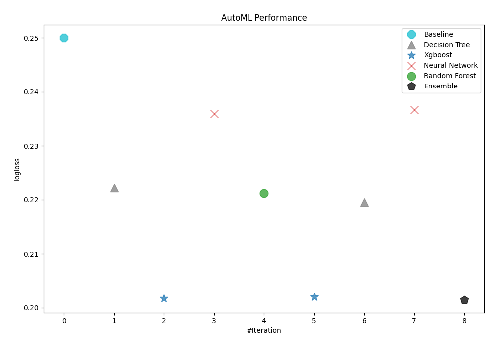
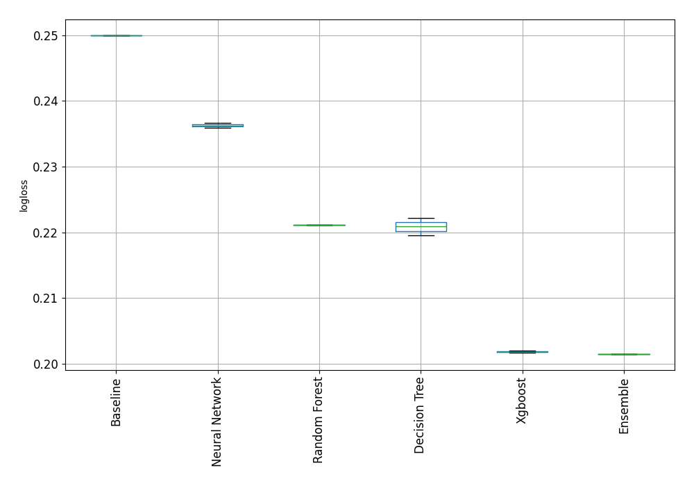
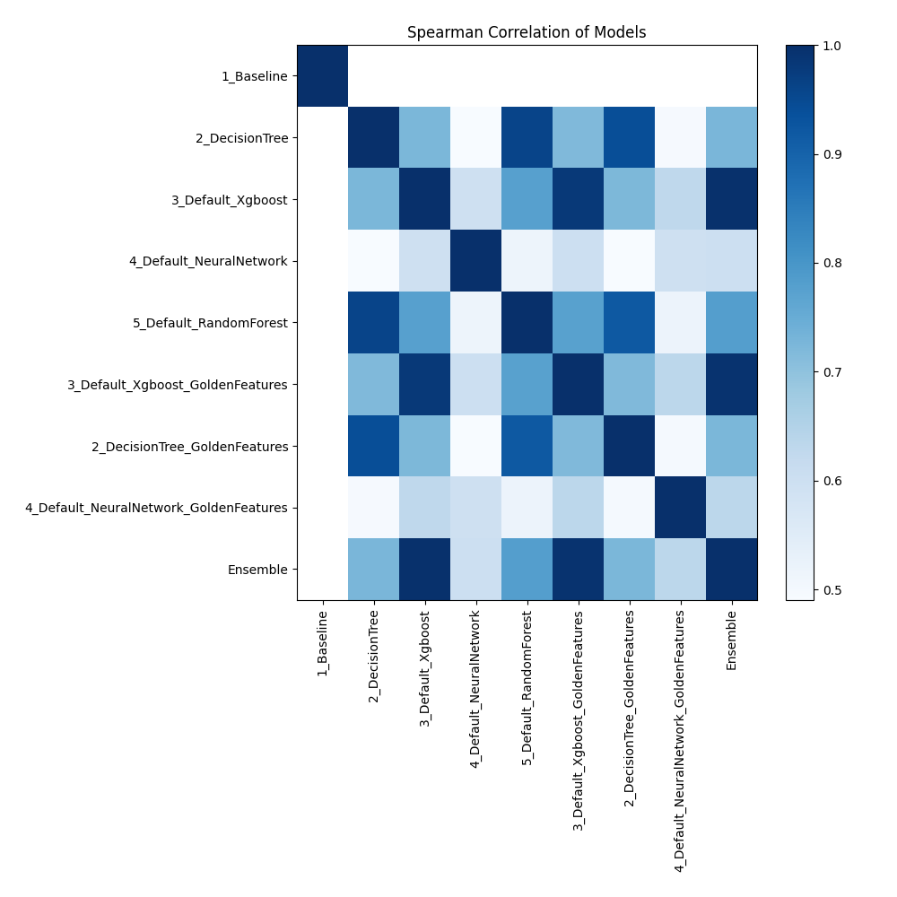

# AutoML Leaderboard

| Best model   | name                                                                                       | model_type     | metric_type   |   metric_value |   train_time |
|:-------------|:-------------------------------------------------------------------------------------------|:---------------|:--------------|---------------:|-------------:|
|              | [1_Baseline](1_Baseline/README.md)                                                         | Baseline       | logloss       |       0.250002 |         2.73 |
|              | [2_DecisionTree](2_DecisionTree/README.md)                                                 | Decision Tree  | logloss       |       0.222161 |       133.45 |
|              | [3_Default_Xgboost](3_Default_Xgboost/README.md)                                           | Xgboost        | logloss       |       0.201696 |       129.52 |
|              | [4_Default_NeuralNetwork](4_Default_NeuralNetwork/README.md)                               | Neural Network | logloss       |       0.235937 |       144.3  |
|              | [5_Default_RandomForest](5_Default_RandomForest/README.md)                                 | Random Forest  | logloss       |       0.221147 |       603.16 |
|              | [3_Default_Xgboost_GoldenFeatures](3_Default_Xgboost_GoldenFeatures/README.md)             | Xgboost        | logloss       |       0.201963 |       129.47 |
|              | [2_DecisionTree_GoldenFeatures](2_DecisionTree_GoldenFeatures/README.md)                   | Decision Tree  | logloss       |       0.219555 |       129.2  |
|              | [4_Default_NeuralNetwork_GoldenFeatures](4_Default_NeuralNetwork_GoldenFeatures/README.md) | Neural Network | logloss       |       0.236634 |       149.24 |
| **the best** | [Ensemble](Ensemble/README.md)                                                             | Ensemble       | logloss       |       0.201486 |         8.39 |

### AutoML Performance

### AutoML Performance Boxplot

### Spearman Correlation of Models

